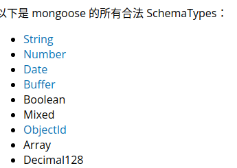

# mongoose使用

## 1.安装

创建node.js项目后，安装mongoose:npm install mongoose

要求已经安装并打开了mongodb数据库

## 2.使用流程

1）引入mongoose:

```
const mongoose = require('mongoose');
```

2）连接数据库：

```
mongoose.connect('mongodb://localhost/test');
```

其中test是数据库名

3）创建一个schema：

```javascript
var schema = new Schema({
  name: String
}, { collation: { locale: 'en_US', strength: 1 } });
```

创建的schema只有在创建mode是引用才可以起作用mongoose.model('Cat', schema);



创建的schema生效 后，存储到数据库的数据必须遵守，否则不予存储，但系统没有原生错误提示，只是存储一个空数据。

4）创建一个model

mongoose.model('Cat', schema);

5）写入数据库

kitty.save()

写入数据集的名称：是定义model的第一个参数，并且进行了修改：保证是英文的复数形式（自动在最后加s，如果没有的话）不区分大小写，全部用小写字母

6）数据查找

数据集.find({查询条件},acllback(err,查询结果)=>{})

查询结果是Array，data[0]._doc是查询出的文档。